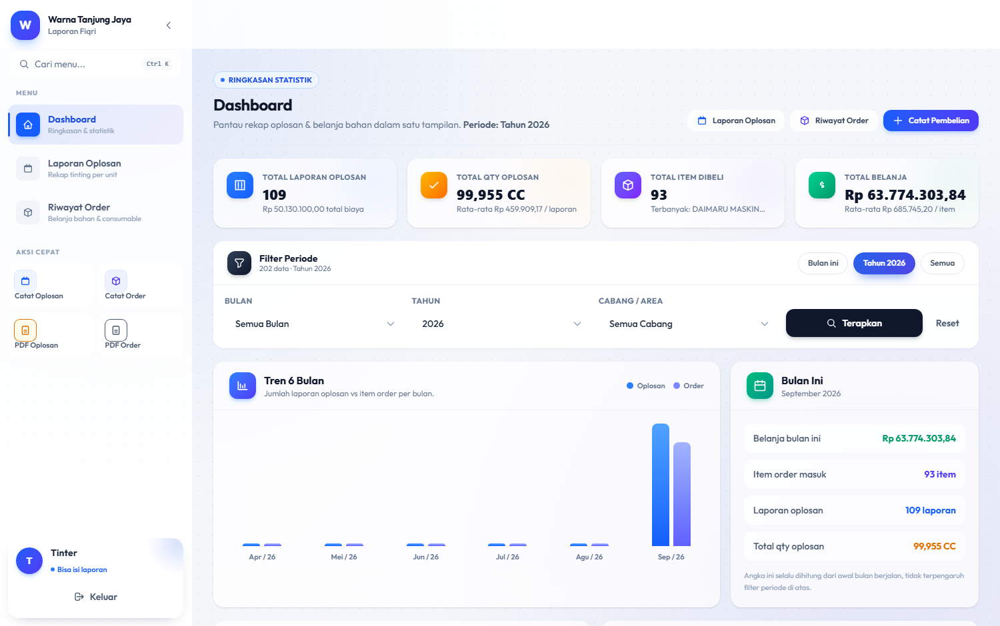
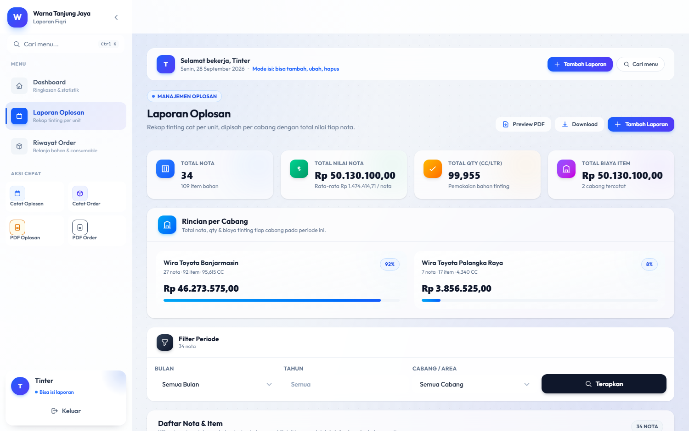
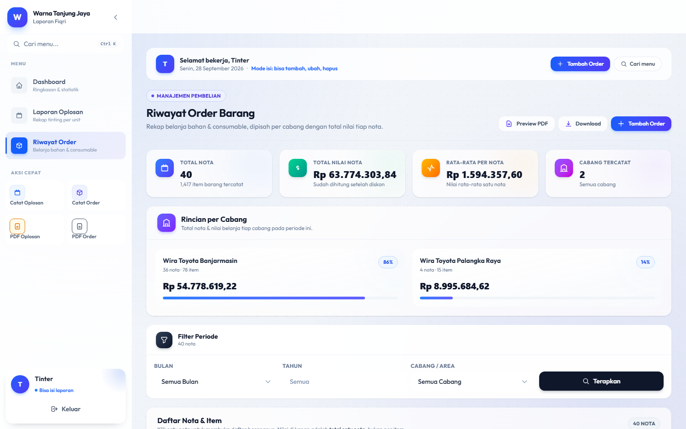
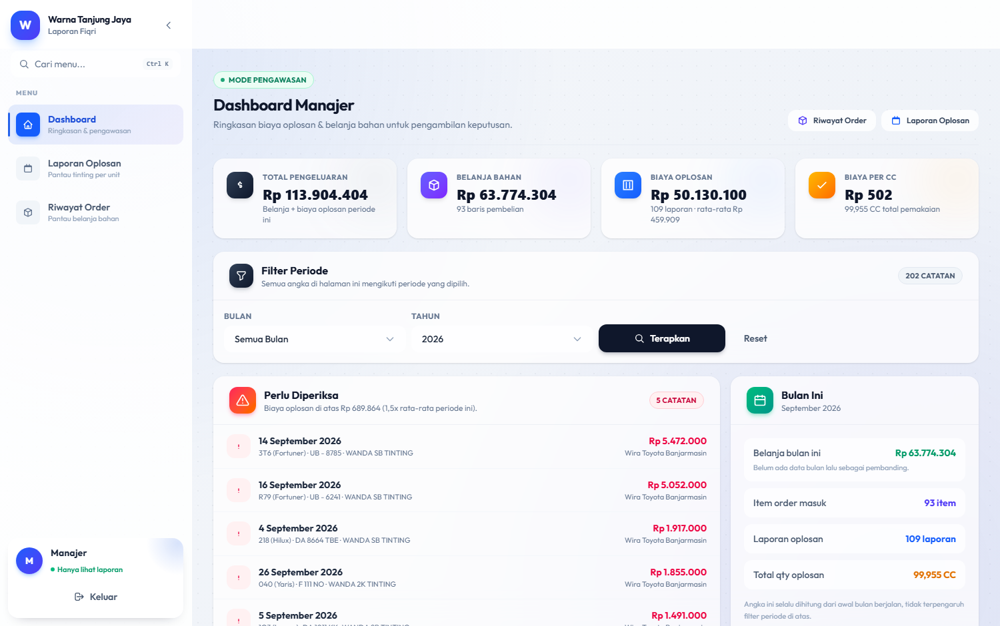
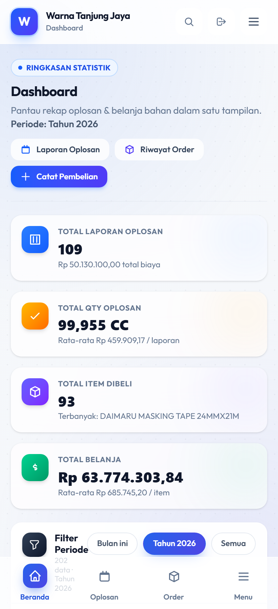
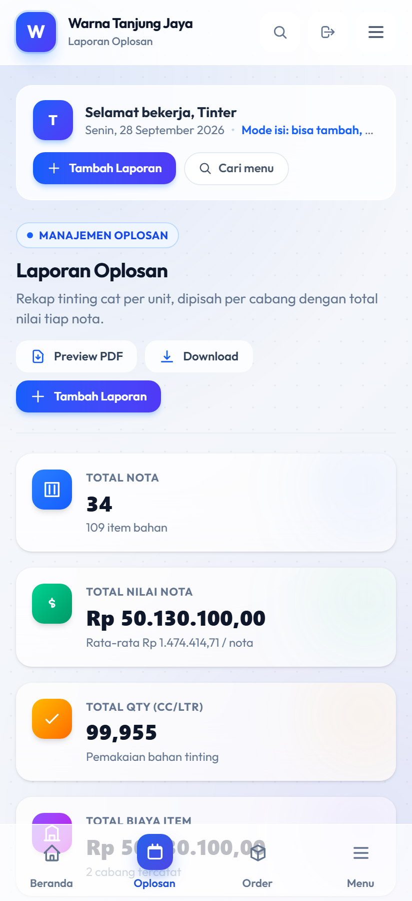

# Laporan Fiqri — Warna Tanjung Jaya

Aplikasi web pencatatan **laporan oplosan (tinting cat)** dan **riwayat order (belanja bahan)** untuk cabang **Wira Toyota Banjarmasin** dan **Wira Toyota Palangka Raya**.

Dibuat dengan Laravel 13 + Tailwind CSS 4, dengan tampilan yang menyesuaikan otomatis di HP, tablet, dan desktop.

---

## Tampilan Aplikasi

### Dashboard
Ringkasan statistik, tren 6 bulan, dan ringkasan bulan berjalan.



### Laporan Oplosan
Rekap tinting per unit, dipisah per cabang, dengan total nilai tiap nota.



### Riwayat Order
Rekap belanja bahan & consumable per cabang.



### Mode Manajer
Tampilan pengawasan — menyorot biaya yang menyimpang dari rata-rata.



### Tampilan di HP
Bottom navigation, kartu bertumpuk, dan tombol besar supaya nyaman dipakai satu tangan.

<p align="center">
  
  &nbsp;&nbsp;
  
</p>

---

## Fitur

### Pencatatan
- **Laporan Oplosan** — catat pemakaian bahan tinting per unit kendaraan (no. plat, kode warna, rincian bahan, qty CC, harga nota).
- **Riwayat Order** — catat pembelian bahan & consumable (kode barang, qty, satuan, harga, diskon).
- Satu nota bisa berisi **banyak item**. Item dengan nomor bukti yang sama otomatis digabung jadi satu nota.
- Upload foto nota/faktur.
- Nomor urut otomatis bila dikosongkan.

### Laporan & Statistik
- **Dashboard** — ringkasan statistik, tren 6 bulan, barang paling sering dibeli, kode warna terbanyak, aktivitas terbaru.
- **Filter** berdasarkan bulan, tahun, dan cabang.
- **Rincian per cabang** — total nota, nilai, dan qty dipisah tiap cabang.
- **Total per nota** — dihitung dari seluruh item dalam satu nota (setelah diskon).
- **Export PDF** — preview di browser, cetak, atau unduh langsung.

### Hak Akses

| Role | Bisa melakukan |
|---|---|
| **Tinter** | Melihat dashboard + **menambah / mengubah / menghapus** laporan |
| **Manajer** | Hanya melihat — tampilan khusus pengawasan (deteksi biaya menyimpang) |

### Tampilan
- Responsif penuh: **bottom navigation** di HP, sidebar di desktop.
- Command palette (Ctrl + K) untuk lompat antar halaman.
- Tabel lebar bisa digeser ke samping tanpa merusak layout.

> Screenshot di atas diambil otomatis lewat `scripts/ambil-screenshot.mjs`
> (Playwright). Jalankan `node scripts/ambil-screenshot.mjs` kalau tampilan berubah.

---

## Kebutuhan Sistem

- **PHP** >= 8.3
- **Composer**
- **Node.js** >= 18 & npm
- **MySQL** (atau SQLite)

---

## Cara Menjalankan

```bash
# 1. Clone repository
git clone https://github.com/fiqrianwar1/Laporan-fiqri.git
cd Laporan-fiqri

# 2. Pasang dependency PHP & JS
composer install
npm install

# 3. Siapkan file konfigurasi
cp .env.example .env
php artisan key:generate
```

Lalu **atur koneksi database** di file `.env`:

```env
DB_CONNECTION=mysql
DB_HOST=127.0.0.1
DB_PORT=3306
DB_DATABASE=laporan_fiqri
DB_USERNAME=root
DB_PASSWORD=
```

```bash
# 4. Buat tabel & akun awal
php artisan migrate
php artisan db:seed

# 5. Build aset tampilan
npm run build

# 6. Jalankan
php artisan serve
```

Buka **http://localhost:8000**

### Akun Bawaan

| Email | Password | Role |
|---|---|---|
| `tinter@warnatanjungjaya.com` | `password` | Tinter (bisa isi) |
| `manajer@warnatanjungjaya.com` | `password` | Manajer (hanya lihat) |

> **Penting:** ganti password ini sebelum dipakai sungguhan.

---

## Membuka dari HP (satu WiFi)

Tersedia skrip `buka-dari-hp.ps1` untuk Windows. Klik kanan file itu lalu pilih **Run with PowerShell**.

Skrip akan otomatis:

1. Mencari IP WiFi laptop
2. Menyetel `APP_URL` agar aset (CSS/JS) ikut termuat
3. Membuka port 8000 di firewall
4. Menjalankan server

Lalu buka link yang muncul di browser HP. **HP harus tersambung ke WiFi yang sama dengan laptop.**

Kalau HP tidak bisa membuka, jalankan skrip tersebut sebagai **Administrator**.

---

## Struktur Singkat

```
app/
  Http/Controllers/
    DashboardController.php        Ringkasan statistik
    LaporanOplosanController.php   CRUD oplosan + PDF
    RiwayatOrderController.php     CRUD order + PDF
    ManajerController.php          Halaman pengawasan
  Models/
    LaporanOplosan.php
    RiwayatOrder.php
  Support/
    Cabang.php                     Daftar cabang (satu sumber)
    NotaGrouper.php                Pengelompokan item jadi nota
    FotoNota.php                   Pengolahan foto nota
    Rupiah.php                     Format angka rupiah
    Tanggal.php                    Format tanggal Indonesia

docs/screenshots/                  Screenshot untuk README
scripts/
  ambil-screenshot.mjs             Ambil screenshot otomatis (Playwright)

resources/views/
  dashboard.blade.php              Dashboard
  laporan_oplosan/                 Halaman & PDF oplosan
  riwayat_order/                   Halaman & PDF order
  manajer/                         Halaman mode pantau
  layouts/                         Layout utama & manajer

database/
  migrations/                      Skema tabel
  seeders/DatabaseSeeder.php       Akun awal
```

### Menambah Cabang Baru

Edit `app/Support/Cabang.php`:

```php
public static function daftar(): array
{
    return [
        'Wira Toyota Banjarmasin',
        'Wira Toyota Palangka Raya',
        'Wira Toyota Cabang Baru',   // tambahkan di sini
    ];
}
```

Dropdown filter, form input, dan pengelompokan laporan otomatis ikut menyesuaikan.

---

## Catatan Teknis

- **Pengelompokan nota** — kunci pengelompokan adalah `nomor bukti + tanggal`, bukan id baris. Jadi satu nota berisi banyak item tetap dihitung **satu nota** di semua total.
- **Nilai total** — `qty x harga satuan - diskon`, dihitung dari accessor `total_item` / kolom `harga_nota`.
- **Filter cabang** — memakai kolom `cabang_area` di kedua tabel (`laporan_oplosans` dan `riwayat_orders`).

---

## Lisensi

Proyek internal Warna Tanjung Jaya. Dibangun di atas [Laravel](https://laravel.com) (MIT License).
